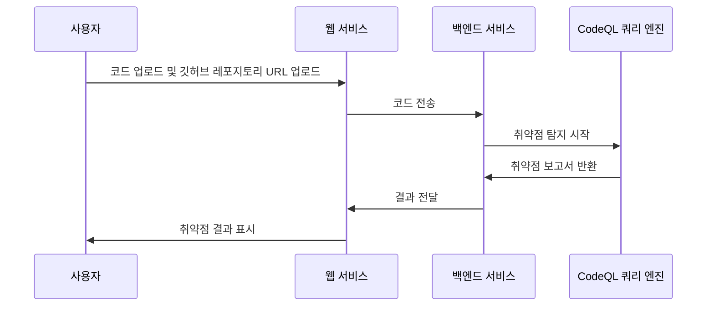

# VulnFinder-CodeQL Project

## Summary
- CodeQL을 이용해 프로그래밍 언어 기반 소스코드 취약점 찾기 플랫폼 구현
- 현재 지원 언어 : JavaScript (추후 추가 예정)

## How To Use?
- /src 폴더내에서 `docker-compose up -d --build`를 수행.
- codeql은 직접 설치해야함.

## Development Spec
- Flask : 백엔드 개발 사용
- DB : SQLAlchemy
- CodeQL : 정적 코드 분석 엔진 사용
- git : 코드 버전 관리 사용
- Docker : 컨테이너 배포 사용
- [Javscript CWE](https://github.com/realsung/VulnFinder-CodeQL/tree/main/src/javascript-cw) 데이터베이스 사용 : CWE 테스트
- [Pixi](https://github.com/DevSlop/Pixi) : 취약점 테스트

## Feture
- 소스코드 .zip파일 업로드 방식, Github Repository 링크 입력 방식 두가지 존재

- 업로드한 파일에 대한 정보로, CodeQL DB 생성, 분석을 수행할 수 있다.
- Result는 아직 미완성(Todo: DB 외래키 지정으로 각 id를 처리해야함)

- Report 페이지로 CodeQL Analysis로 나온 취약점 이름, 설명, 이유, 경로, 어느 라인에서 취약점이 발생하는지 등의 정보를 확인할 수 있다.

## Pages
- / : Main 페이지
- /upload : 소스코드 업로드 페이지
- /list : 업로드된 파일 리스팅, CodeQL DB생성, 분석 가능
- /list-csv : csv 파일 리스팅 (삭제 예정)
- /codeql-create : CodeQL DB 생성
- /codeql-analysis : CodeQL DB 분석
- /result : 각 소스코드별로 취약점 보여주기 (미구현)
- /status : 취약점 결과 페이지
- /test : CodeQL 스크립트 리스팅

## Todo
- [x] 프로젝트 기획
- [x] 어떤 Framework 쓸지 선정
- [x] CodeQL 쿼리 탐지할 CWE 선정
- [x] CodeQL 쿼리 작성
- [x] 프론트
- [x] 백엔드 구현
- [x] CWE 테스트
- [x] CWE기반 취약점 텥스트

## 사후 관리
- [ ] Multi Processing, Multi Threading 적용
- [ ] Python 분석 추가
- [ ] Java 분석 추가
- [ ] C/C++ 분석 추가
- [ ] Go 분석 추가

## CWE
- [CWE coverage for Python](https://codeql.github.com/codeql-query-help/codeql-cwe-coverage/)
- [CWE coverage for Javascript and TypeScript](https://codeql.github.com/codeql-query-help/javascript-cwe/)

## Python
- [CODEQL Document](https://codeql.github.com/codeql-query-help/python/)
- [Test Set #1](https://github.com/10thmagnitude/custom-codeql-python)
- [Test Set #2](https://github.com/AlexAltea/codeql-python)

## Javascript
- [Test Set #1](https://github.com/DevSlop/Pixi)
- [Test Set #2](https://github.com/github/codeql/tree/main/javascript/ql/src/Security)

## Reference
- [Code security documentation](https://docs.github.com/en/code-security)
- [CodeQL Documentation](https://codeql.github.com/docs/)
- [CodeQL zero to hero part 1: the fundamentals of static analysis for vulnerability research](https://github.blog/2023-03-31-codeql-zero-to-hero-part-1-the-fundamentals-of-static-analysis-for-vulnerability-research/)
- [CodeQL zero to hero part 2: getting started with CodeQL](https://github.blog/2023-06-15-codeql-zero-to-hero-part-2-getting-started-with-codeql/)
- [ICYMI: improved C++ vulnerability coverage and CodeQL support for Lombok](https://github.blog/2023-10-19-icymi-improved-c-vulnerability-coverage-and-codeql-support-for-lombok/)
- [The GitHub Security Lab’s journey to disclosing 500 CVEs in open source projects](https://github.blog/2023-09-21-the-github-security-labs-journey-to-disclosing-500-cves-in-open-source-projects/)
