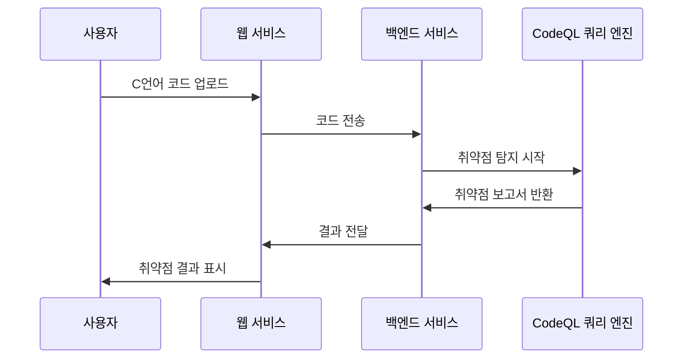

# VulnFinder-CodeQL Project

## Summary
- CodeQL을 이용해 C언어 기반 소스코드 취약점 찾기 플랫폼 구현

## Development Spec
- Flask : 백엔드 개발 사용
- CodeQL : 정적 코드 분석 엔진 사용
- git : 코드 버전 관리 사용
- Docker : 컨테이너 배포 사용
- Github Actions : CI/CD 사용
- Juliet C/C++ 1.3 - NIST Software Assurance Reference Dataset : 코드 테스트 데이터셋 사용

## Todo
- [x] 프로젝트 기획
- [x] 어떤 Framework 쓸지 선정
- [ ] CodeQL 쿼리 탐지할 CWE 선정
- [ ] CodeQL 쿼리 작성
- [x] 프론트
- [ ] 백엔드 구현
- [ ] CWE 테스트
- [ ] CVE 테스트 선정
